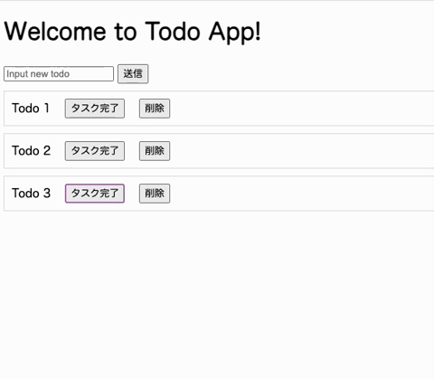

# todo-app-go

## 概要

Go言語で作成したTodoアプリです。

アプリ作成の基礎を学ぶための習作。

また、各々のコンポーネントを切り替えて、キャッチアップに使うためのプロダクトでもあります。

## 使用イメージ

## 技術スタック

- Go
- MySQL
- HTML/CSS
- JavaScript

## 作業ログ

作業ログはZennのスクラップに残しています。

[作業ログ@ZennScrap](https://zenn.dev/kip2/scraps/177cb54290d240)

## 触発

以下の記事に触発されて作成しています。

[アウトプットのお題に選ぶ、奥深い自作「TODOアプリ」。mattn氏が教える、さらなる技術力の向上を目指すためのノウハウとは](https://levtech.jp/media/article/column/detail_473/)

このリポジトリをフォークして、バックエンド、フロントエンド、それぞれで技術を入れ替えて行えばキャッチアップが行えるという寸法